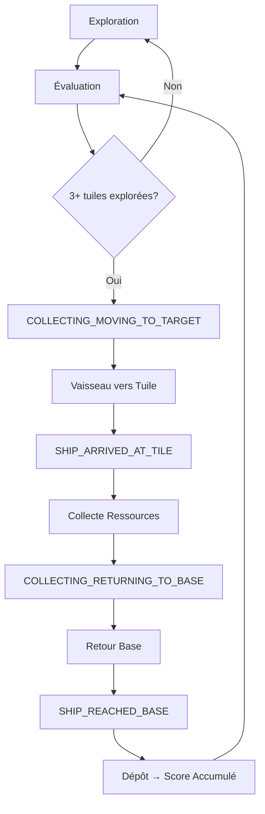

# 📦 Plan d'Implémentation - Fonctionnalité de Collecte de Ressources

> **Objectif** : Implémenter la collecte de ressources avec animation du vaisseau et accumulation dans le score du bot, en utilisant l'architecture FSM existante sans créer de nouveaux fichiers.

## 🔍 Analyse du Code Actuel

### ✅ Architecture Existante Disponible

#### 1. **États FSM pour la Collecte**
- ✅ `BOT_STATES.COLLECTING_MOVING_TO_TARGET` - Vaisseau se dirige vers la tuile
- ✅ `BOT_STATES.COLLECTING_RETURNING_TO_BASE` - Vaisseau retourne à la base  
- ✅ `BOT_STATES.COLLECTING` - État de collecte générique (legacy)

#### 2. **Actions de Collecte**
- ✅ `shipCollectsFromTile()` - Collecte les ressources depuis la mémoire unifiée
- ✅ `selectBestTileForCollection()` - Sélection automatique de la meilleure tuile
- ✅ Gestion des capacités et validation des ressources

#### 3. **Événements FSM**
- ✅ `SHIP_ARRIVED_AT_TILE` - Vaisseau arrivé à la tuile cible
- ✅ `SHIP_COLLECTION_COMPLETED` - Collecte terminée 
- ✅ `SHIP_REACHED_BASE` - Retour à la base

#### 4. **Hooks d'Animation**
- ✅ `useFSMShipTracker` - Surveillance mouvement + événements FSM
- ✅ `useShipAnimation` - Animation visuelle du vaisseau
- ✅ Intégration existante avec Fleet.jsx

#### 5. **Mémoire Unifiée**
- ✅ `context.memory.knownTiles` - Map des tuiles explorées
- ✅ `context.vehicle.resources` - Inventaire actuel du vaisseau
- ✅ Statistiques de collecte (`tilesCollected`, `totalResourcesFound`)

### 🔧 Composants à Modifier

1. **useFSMShipTracker.js** - Déjà préparé avec la logique de collecte
2. **useShipAnimation.js** - Animation existante pour l'état `collecting`
3. **collectingState.js** - Transitions FSM déjà définies
4. **evaluatingState.js** - Logique de transition vers collecte
5. **shipCollectingActions.js** - Actions de collecte complètes

### ❌ Manques Identifiés

1. **Transfert vers Score du Bot** - Pas d'accumulation persistante
2. **Animation Fluide** - Mouvement vers tuile cible pas optimal
3. **Gestion Base/Dépôt** - Pas de transfert automatique à la base
4. **Intégration visuelle** - Pas d'indication visuelle de la collecte

---

## 🎯 Plan de Prompts Détaillé

### **PROMPT 1 : Corriger les Erreurs de Compilation dans useFSMShipTracker.js** ✅
**Objectif** : Fixer les erreurs `fsmlogger` → `fsmLogger` et finaliser la logique de collecte

**Fichiers modifiés** :
- `/src/ai/fsm/hooks/useFSMShipTracker.js`

**Actions réalisées** :
1. ✅ Corrigé `fsmlogger` → `fsmLogger` (lignes 127, 150, 162, 194)
2. ✅ Ajouté validation pour la tuile cible avant collecte
3. ✅ Améliorer la collecte pour utiliser `context.selectedTileForCollection` en priorité
4. ✅ Ajouté fallback vers TileStore si pas de données FSM
5. ✅ Ajouté logging des ressources avec `fsmLogger.resources()`
6. ✅ Ajouté throttling des logs de debug avec `lastUpdateTime`
7. ✅ Améliorer la détection d'action avec support pour `moving_to_target`

**Résultat** : Le hook compile sans erreur et la logique de collecte est prête à être utilisée.

---

### **PROMPT 2 : Améliorer l'Animation du Vaisseau pour la Collecte**
**Objectif** : Animation fluide vers la tuile cible et feedback visuel

**Fichiers à modifier** :
- `/src/animations/useShipAnimation.js`
- `/src/components/Vehicles/ShipMesh.jsx`

**Actions** :
1. Améliorer l'interpolation vers `targetPosition` pour la collecte
2. Ajouter animation visuelle spécifique quand `currentAction === 'collecting'`
3. Indicateur visuel sur ShipMesh (couleur émissive, oscillation)
4. Gérer la transition de mouvement → collecte → retour

---

### **PROMPT 3 : Implémenter l'Accumulation des Ressources dans le Score**
**Objectif** : Créer un système de score persistant pour chaque bot

**Fichiers à modifier** :
- `/src/ai/fsm/machine/context/initialContext.js`
- `/src/ai/fsm/machine/actions/core/shipCollectingActions.js`
- `/src/ai/fsm/machine/reducers/context.js`

**Actions** :
1. Ajouter `accumulatedScore.resources` dans le contexte initial FSM
2. Modifier `shipCollectsFromTile` pour transférer vers le score accumulé
3. Créer une action `transferResourcesToScore()` 
4. Ajouter statistiques de score total par bot

---

### **PROMPT 4 : Activer les Transitions vers la Collecte dans evaluatingState.js**
**Objectif** : S'assurer que le bot passe en mode collecte quand approprié

**Fichiers à modifier** :
- `/src/ai/fsm/machine/states/evaluatingState.js`

**Actions** :
1. Vérifier la priorité de la transition `COLLECTING_MOVING_TO_TARGET`
2. Déboguer les guards `hasExploredEnoughTiles()` et `hasBestTileForCollection()`
3. Ajuster la logique pour déclencher la collecte après 2-3 tuiles explorées
4. Tester le cycle exploration → évaluation → collecte

---

### **PROMPT 5 : Intégrer le Dépôt de Ressources à la Base**
**Objectif** : Transfert automatique des ressources quand le vaisseau retourne à la base

**Fichiers à modifier** :
- `/src/ai/fsm/machine/states/collectingState.js`
- `/src/ai/fsm/machine/actions/core/shipCollectingActions.js`

**Actions** :
1. Ajouter logique de dépôt dans la transition `SHIP_REACHED_BASE`
2. Créer action `shipDepositResourcesAtBase()` 
3. Vider l'inventaire du vaisseau et transférer vers le score
4. Logger le dépôt avec `fsmLogger.resources()`

---

### **PROMPT 6 : Améliorer les Indicateurs Visuels et Debug**
**Objectif** : Feedback visuel pour la collecte et monitoring des ressources

**Fichiers à modifier** :
- `/src/components/FSM/FSMDebugPanel.jsx`
- `/src/components/HUD/TileStoreMonitor.jsx`
- `/src/components/Vehicles/ShipMesh.jsx`

**Actions** :
1. Afficher les ressources accumulées par bot dans FSMDebugPanel
2. Indicateur visuel sur les tuiles collectées
3. Animation du vaisseau pendant la collecte (pulsation, couleur)
4. Log détaillé des collectes dans TileStoreMonitor

---

### **PROMPT 7 : Tests et Optimisation**
**Objectif** : Validation complète du cycle exploration → collecte → dépôt

**Fichiers à modifier** :
- Tests de l'ensemble du système

**Actions** :
1. Tester le cycle complet : exploration → évaluation → collecte → retour → dépôt
2. Vérifier l'accumulation des ressources sur plusieurs cycles
3. Optimiser les seuils de transition (nombre de tuiles avant collecte)
4. Documenter les performances et les métriques

---

## 🔄 Flux de Données Cible

## 📊 Métriques de Succès

- ✅ Le vaisseau se dirige vers les tuiles avec ressources
- ✅ Animation fluide de collecte avec feedback visuel
- ✅ Ressources transférées de `vehicle.resources` → `accumulatedScore.resources`  
- ✅ Score persistant qui s'accumule sur plusieurs cycles
- ✅ Retour automatique à la base après collecte
- ✅ Cycle complet exploration → collecte fonctionnel

## 🛠️ Architecture Technique

### États FSM Utilisés
1. `EVALUATING` → Décision d'aller collecter
2. `COLLECTING_MOVING_TO_TARGET` → Mouvement vers tuile
3. `COLLECTING_RETURNING_TO_BASE` → Retour à la base
4. `EVALUATING` → Nouveau cycle

### Données Clés
- `context.memory.knownTiles` - Tuiles explorées avec ressources
- `context.vehicle.resources` - Inventaire temporaire du vaisseau  
- `context.accumulatedScore.resources` - **[NOUVEAU]** Score persistant du bot
- `context.selectedTileForCollection` - Tuile ciblée pour collecte

### Événements FSM
- `SHIP_ARRIVED_AT_TILE` - Déclenche la collecte
- `SHIP_COLLECTION_COMPLETED` - Collecte terminée  
- `SHIP_REACHED_BASE` - Déclenche le dépôt

---

**Ce plan permet d'implémenter une fonctionnalité de collecte complète en utilisant l'architecture FSM existante, avec accumulation des ressources et animations visuelles, sans créer de nouveaux fichiers.**
