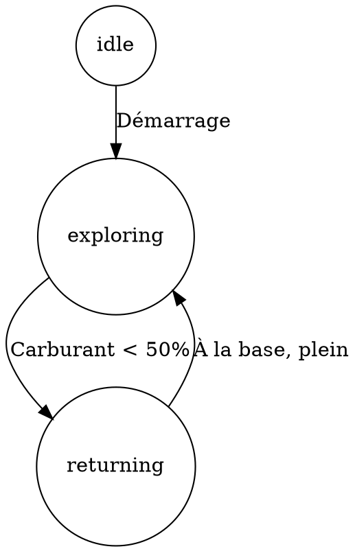

# Guide d'Organisation pour un FSM Évolutif

Ce guide propose des stratégies d'organisation pour faciliter l'extension de votre machine à états finis (FSM) à mesure que la complexité augmente.

## 1. Structurer votre code par domaines de responsabilité

```javascript
// src/stores/useSimpleBotStore.js

// === DÉFINITIONS DES ÉTATS ET CONSTANTES ===
const BOT_STATES = { 
  IDLE: 'idle',
  EXPLORING: 'exploring',
  RETURNING: 'returning',
  // Nouveaux états à ajouter ici
  // HARVESTING: 'harvesting',
  // COMBAT: 'combat',
};

const PRIORITY = { /* ... */ };

// === DÉFINITION DES ACTIONS DISPONIBLES ===
const ACTION_TYPES = {
  MOVE: 'move',
  RETURN_TO_BASE: 'returnToBase',
  REFUEL: 'refuel',
  // Nouvelles actions à ajouter ici
  // HARVEST: 'harvest',
  // ATTACK: 'attack',
};

const useSimpleBotStore = create((set, get) => ({
  // === ÉTAT INTERNE DU STORE ===
  botState: BOT_STATES.IDLE,
  isRunning: false,
  actionQueue: [],
  
  // === GESTION D'ÉTAT (FSM CORE) ===
  initializeBot: () => { /* ... */ },
  changeState: (newState) => { /* ... */ },
  
  // === GESTION DE LA FILE D'ACTIONS ===
  addAction: (actionType, priority, params) => { /* ... */ },
  removeFirstAction: () => { /* ... */ },
  executeNextAction: () => {
    // Centralisez ici l'aiguillage vers les fonctions d'action
    const { type } = get().actionQueue[0];
    
    // Utilisez un mappage explicite des types d'action vers les fonctions
    const actionHandlers = {
      [ACTION_TYPES.MOVE]: get().moveToRandomTile,
      [ACTION_TYPES.RETURN_TO_BASE]: get().returnToBase,
      [ACTION_TYPES.REFUEL]: get().refuelAtBase,
      // Ajoutez de nouveaux handlers ici
    };
    
    // Exécutez l'action si un handler existe
    if (actionHandlers[type]) {
      return actionHandlers[type]();
    }
    
    console.warn(`Unknown action type: ${type}`);
    return false;
  },
  
  // === LOGIQUE DE DÉCISION (CONDITIONS) ===
  checkConditions: () => {
    // Séparation des conditions dans des fonctions dédiées
    get().checkFuelCondition();
    get().checkDamageCondition();
    // Ajoutez de nouvelles vérifications de conditions ici
  },
  
  // Conditions individuelles
  checkFuelCondition: () => {
    const currentState = get().botState;
    const botVehicle = usePlayerStore.getState().players.player2?.vehicles?.ship;
    
    if (currentState === BOT_STATES.EXPLORING && botVehicle?.fuel < 50) {
      get().changeState(BOT_STATES.RETURNING);
      get().addAction(ACTION_TYPES.RETURN_TO_BASE, PRIORITY.HIGH);
    }
  },
  
  checkDamageCondition: () => {
    // Nouvelle condition à implémenter
  },
  
  // === ACTIONS SPÉCIFIQUES (IMPLEMENTATION) ===
  // Organisez par domaine fonctionnel
  
  // Actions de mouvement
  moveToRandomTile: () => { /* ... */ },
  moveToBestResourceTile: () => { /* ... */ },
  
  // Actions de base
  returnToBase: () => { /* ... */ },
  refuelAtBase: () => { /* ... */ },
  repairAtBase: () => { /* ... */ },
  
  // Actions de ressources (nouveau domaine)
  harvestResource: () => { /* ... */ },
  
  // === SYSTÈME DE TRAITEMENT PRINCIPAL ===
  processBot: () => {
    // Structurez clairement les étapes
    get().checkConditions();
    get().fillEmptyQueue();
    get().executeNextAction();
  },
  
  // Remplissage de la file basé sur l'état courant
  fillEmptyQueue: () => {
    if (get().actionQueue.length === 0) {
      const actionsByState = {
        [BOT_STATES.IDLE]: () => {},
        [BOT_STATES.EXPLORING]: () => get().addAction(ACTION_TYPES.MOVE, PRIORITY.LOW),
        [BOT_STATES.RETURNING]: () => get().addAction(ACTION_TYPES.RETURN_TO_BASE, PRIORITY.HIGH),
        // Ajoutez de nouvelles actions par état ici
      };
      
      const currentState = get().botState;
      if (actionsByState[currentState]) {
        actionsByState[currentState]();
      }
    }
  },
  
  toggleBotProcessing: () => { /* ... */ },
  
  // === EXPORTS ===
  ACTION_TYPES,
  BOT_STATES,
  PRIORITY
}));
```

## 2. Créer un tableau de transitions explicite

Pour clarifier davantage les transitions entre états, ajoutez une définition explicite des transitions possibles :

```javascript
// À ajouter dans votre store

const STATE_TRANSITIONS = [
  {
    from: BOT_STATES.EXPLORING,
    to: BOT_STATES.RETURNING,
    condition: (botVehicle) => botVehicle?.fuel < 50,
    action: (store) => store.addAction(ACTION_TYPES.RETURN_TO_BASE, PRIORITY.HIGH)
  },
  {
    from: BOT_STATES.RETURNING, 
    to: BOT_STATES.EXPLORING,
    condition: (botVehicle) => botVehicle?.fuel >= 100 && botVehicle?.coord === botVehicle?.startCoord,
    action: (store) => store.addAction(ACTION_TYPES.MOVE, PRIORITY.MEDIUM)
  },
  // Ajoutez de nouvelles transitions ici
];

// Puis dans checkConditions()
checkConditions: () => {
  const currentState = get().botState;
  const botVehicle = usePlayerStore.getState().players.player2?.vehicles?.ship;
  
  if (!botVehicle) return;
  
  // Parcourir les transitions possibles depuis l'état actuel
  for (const transition of STATE_TRANSITIONS) {
    if (transition.from === currentState && transition.condition(botVehicle)) {
      console.log(`[SimpleBotStore] Transition from ${transition.from} to ${transition.to}`);
      get().changeState(transition.to);
      transition.action(get());
      break; // Une seule transition par cycle
    }
  }
}
```

## 3. Documenter clairement chaque nouvelle extension

Pour chaque nouvel état ou action que vous ajoutez, incluez un bloc de commentaires standard qui explique :

```javascript
/**
 * État: HARVESTING
 * Description: Le bot collecte activement des ressources d'une tuile.
 * Conditions d'entrée:
 *   - Depuis EXPLORING quand une ressource est détectée
 * Conditions de sortie:
 *   - Vers EXPLORING quand la ressource est épuisée
 *   - Vers RETURNING quand le carburant est bas (<50%)
 * Actions associées:
 *   - 'harvest' (MEDIUM): Collecter des ressources sur la tuile actuelle
 */
```

## 4. Créer un fichier de documentation des extensions

Créez un fichier `SimpleBotExtensions.md` qui liste tous les états et actions, explique leur fonction et indique où ajouter du code pour chaque type d'extension :

```markdown
# Guide d'Extension du SimpleBot

## Ajouter un Nouvel État

1. Ajoutez le nom de l'état dans l'objet `BOT_STATES`
2. Ajoutez une condition de transition vers cet état dans `STATE_TRANSITIONS`
3. Ajoutez une gestion de cet état dans la fonction `fillEmptyQueue`
4. Documentez l'état et ses transitions

## Ajouter une Nouvelle Action

1. Ajoutez le type d'action dans l'objet `ACTION_TYPES`
2. Créez une fonction d'implémentation de l'action dans la section appropriée
3. Ajoutez le mapping dans `actionHandlers` dans `executeNextAction`
4. Documentez l'action et son utilisation
```

## 5. Visualisez votre FSM

Créez un fichier `botFSM.dot` qui représente visuellement votre machine à états, et mettez-le à jour à chaque extension :



Vous pouvez utiliser des outils comme Graphviz pour générer une visualisation graphique de votre FSM à partir de ce fichier.

## Bénéfices de cette approche

Cette structure organisée vous permettra de :

1. **Identifier facilement** où ajouter de nouveaux états, conditions et actions
2. **Maintenir une séparation claire** entre les différentes responsabilités
3. **Documenter systématiquement** votre système au fur et à mesure qu'il évolue
4. **Visualiser** la structure complète de votre FSM
5. **Réduire les bugs** en ayant un modèle cohérent et explicite pour les extensions

À mesure que la complexité de votre bot augmente, cette structure vous aidera à garder un code organisé, maintenable et extensible.