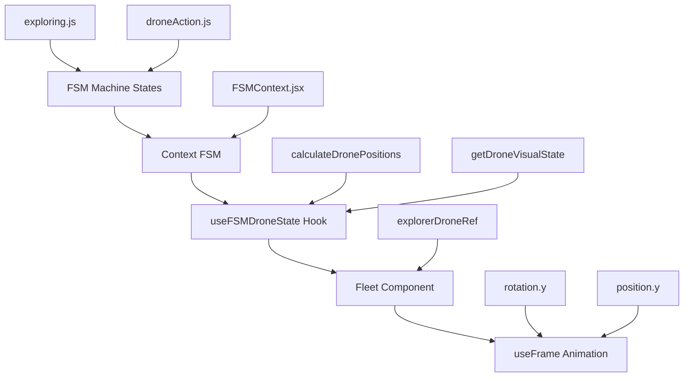
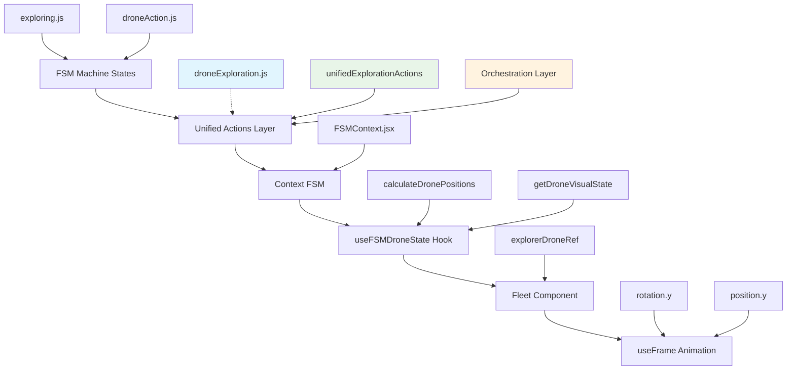

# Pipeline FSM → Animation Drone - Documentation Complète

## 🎯 Vue d'ensemble

Ce document explique la chaîne complète de traitement qui transforme l'état d'une machine FSM en animation 3D de drones dans React Three Fiber.

**Pipeline simplifié :**
```
FSM Machine → Context → Hook → Composant → useFrame Animation
```

---

## 📋 Table des matières

1. [Architecture Générale](#architecture-générale)
2. [Étape 1: Machine FSM](#étape-1-machine-fsm)
3. [Étape 2: Contexte FSM](#étape-2-contexte-fsm)
4. [Étape 3: Hook d'accès](#étape-3-hook-daccès)
5. [Étape 4: Composant Fleet](#étape-4-composant-fleet)
6. [Étape 5: Animation useFrame](#étape-5-animation-useframe)
7. [Flux de données détaillé](#flux-de-données-détaillé)
8. [Fonctions clés](#fonctions-clés)
9. [Debugging et Outils de Développement](#debugging-et-outils-de-développement)
10. [Checklist de vérification](#checklist-de-vérification)
11. [Concepts pédagogiques](#concepts-pédagogiques)
12. [Pratiques Alternatives et Variations](#pratiques-alternatives-et-variations)

---

## 🏗️ Architecture Générale

### Architecture Standard (Original)


### 🆕 Architecture Unifiée (Recommandée)


> **Note :** L'architecture unifiée introduit une couche d'orchestration qui simplifie l'API et améliore la cohérence entre les systèmes de déploiement de drones et d'exploration.

---

## 🎮 Étape 1: Machine FSM

### Fichier: `/src/ai/fsm/machine/states/exploring.js`

**Rôle:** Définit les états et transitions des drones d'exploration.

**États principaux:**
- `docked` - Drone attaché au vaisseau
- `exploring` - Drone en mission d'exploration  
- `returning` - Drone qui retourne au vaisseau

**Fonctions clés:**
```javascript
// Transition vers l'exploration
transition(MOVEMENT_EVENT_TYPES.DRONE_DEPLOYED, BOT_STATES.EXPLORING, 
  guard(() => true),
  reduce((context, event) => {
    return {
      ...context,
      isDroneAtShip: false,
      droneTarget: event.targetArea,
      deploymentTime: Date.now(),
      currentAction: 'drone_exploring'
    };
  })
)
```

### Fichier: `/src/shared/actions/core/droneAction.js`

**Rôle:** Actions pures pour le déploiement et contrôle des drones.

**États de drone:**
```javascript
export const DRONE_DEPLOYMENT_STATES = {
  DOCKED: 'docked',
  DEPLOYING: 'deploying', 
  ACTIVE: 'active',
  RETURNING: 'returning',
  FAILED: 'failed'
};
```

**Fonction de déploiement:**
```javascript
export const deployDrone = (context, droneType, targetArea) => {
  // Logique de déploiement
  // Met à jour context.droneFleet.drones[droneType]
}
```

---

## 🔗 Étape 2: Contexte FSM

### Fichier: `/src/ai/fsm/contexts/FSMContext.jsx`

**Rôle:** Fournit le contexte React pour accéder aux états FSM.

**Composant Provider:**
```jsx
export const FSMProvider = ({ children }) => {
  // Fournit l'accès global aux machines FSM
  return (
    <FSMContext.Provider value={contextValue}>
      {children}
    </FSMContext.Provider>
  );
};
```

### Fichier: `/src/components/FSM/BotInstance.jsx`

**Rôle:** Instance individuelle d'un bot FSM, capture le contexte complet.

**Hook de machine:**
```javascript
const { state, context, send } = useBotMachineFixed(botId, {
  // Configuration du bot
});

// Capture du contexte complet pour le store
useEffect(() => {
  setBotState(botId, {
    state: state.value,
    context: context, // ← Contexte complet avec droneFleet
    canTransition: state.can,
    // ...
  });
}, [state, context]);
```

---

## 🎣 Étape 3: Hook d'accès

### Fichier: `/src/hooks/useFSMDroneState.js`

**Rôle:** Hook React pour accéder à l'état des drones depuis le contexte FSM.

**Fonction principale:**
```javascript
export const useFSMDroneState = (botId) => {
  const [droneFleet, setDroneFleet] = useState(null);
  
  // Accès au snapshot des états FSM
  const botStatesSnapshot = useFSMStore((state) => state.metrics.botStatesSnapshot);
  
  useEffect(() => {
    const botState = botStatesSnapshot[botId];
    const newDroneFleet = botState.context?.droneFleet; // ← Extraction des drones
    setDroneFleet(newDroneFleet);
  }, [botId, botStatesSnapshot]);
```

**Fonctions de calcul:**
```javascript
// Calcule les positions 3D des drones
const calculateDronePositions = (shipPosition) => {
  const positions = {};
  
  Object.entries(droneFleet?.drones || {}).forEach(([droneType, drone]) => {
    switch (drone.state) {
      case 'docked':
        positions[droneType] = shipPosition; // Proche du vaisseau
        break;
      case 'exploring':
        positions[droneType] = drone.targetPosition || generateExplorationPosition();
        break;
      case 'returning':
        positions[droneType] = drone.targetPosition || shipPosition;
        break;
    }
  });
  
  return positions;
};

// État visuel pour l'animation
const getDroneVisualState = (droneType) => {
  return droneFleet?.drones[droneType]?.state || 'docked';
};

// Détection de mouvement
const isDroneMoving = (droneType) => {
  const drone = droneFleet?.drones[droneType];
  return drone?.state === 'deploying' || drone?.state === 'returning';
};
```

**Interface de retour:**
```javascript
return {
  drones: droneFleet?.drones || {},
  calculateDronePositions,
  getDroneVisualState,
  isDroneMoving,
  // ...
};
```

---

## 🚁 Étape 4: Composant Fleet

### Fichier: `/src/components/Fleet.jsx`

**Rôle:** Composant React Three Fiber qui rend les drones en 3D.

**Récupération des données FSM:**
```javascript
const Fleet = ({ botId, shipPosition, color }) => {
  // 1. Accès aux données FSM via le hook
  const {
    drones,
    calculateDronePositions,
    getDroneVisualState,
    isDroneMoving
  } = useFSMDroneState(botId);
  
  // 2. Calcul des positions basées sur l'état FSM
  const dronePositions = useMemo(() => {
    return calculateDronePositions(shipPosition);
  }, [shipPosition, calculateDronePositions]);
  
  // 3. Position finale du drone
  const explorerPosition = dronePositions.explorer || shipPosition;
```

**Référence pour l'animation:**
```javascript
const explorerDroneRef = useRef(); // ← Référence Three.js pour l'animation
```

**Rendu 3D:**
```jsx
<group 
  ref={explorerDroneRef}
  position={[explorerPosition.x, explorerPosition.y, explorerPosition.z]}
>
  <Cone args={[0.15, 0.4, 8]}>
    <meshStandardMaterial 
      color={color}
      // État FSM → Couleur émissive
      emissive={getDroneVisualState('explorer') === 'exploring' ? color : "black"}
      emissiveIntensity={getDroneVisualState('explorer') === 'exploring' ? 0.8 : 0.2}
    />
  </Cone>
</group>
```

---

## 🎬 Étape 5: Animation useFrame

### Animation basée sur l'état FSM

**Boucle d'animation:**
```javascript
useFrame(() => {
  if (!explorerDroneRef.current) return;
  
  // Récupération de l'état FSM actuel
  const droneState = getDroneVisualState('explorer'); // ← État depuis FSM
  const time = Date.now() * 0.001;
  
  // Animation différente selon l'état FSM
  switch (droneState) {
    case 'docked':
      // Rotation lente en formation
      explorerDroneRef.current.rotation.y = time * 0.5;
      break;
      
    case 'exploring':
      // Oscillation plus rapide en exploration
      explorerDroneRef.current.rotation.y = time * 2;
      explorerDroneRef.current.position.y = explorerPosition.y + Math.sin(time * 3) * 0.2;
      break;
      
    case 'returning':
      // Mouvement de retour
      explorerDroneRef.current.rotation.y = time * -1;
      break;
  }
});
```

---

## 📊 Diagramme de flux technique

```
┌─────────────────┐    ┌──────────────────┐    ┌─────────────────────┐
│   exploring.js  │    │ droneAction.js│    │   BotInstance.jsx   │
│                 │    │                   │    │                     │
│ • transition()  │    │ • deployDrone()   │    │ • useBotMachineFixed│
│ • reduce()      │───▶│ • DRONE_STATES    │───▶│ • setBotState()     │
│ • guard()       │    │ • updatePosition()│    │ • context capture   │
└─────────────────┘    └──────────────────┘    └─────────────────────┘
         │                       │                        │
         ▼                       ▼                        ▼
┌─────────────────────────────────────────────────────────────────────┐
│                    useFSMStore (Zustand)                           │
│                                                                     │
│  botStatesSnapshot: {                                               │
│    "fsm-bot-0": {                                                   │
│      state: "exploring",                                            │
│      context: {                                                     │
│        droneFleet: {                                                │
│          drones: {                                                  │
│            explorer: {                                              │
│              state: "exploring",                                    │
│              position: { x, y, z },                                 │
│              targetPosition: { x, y, z }                            │
│            }                                                        │
│          }                                                          │
│        }                                                            │
│      }                                                              │
│    }                                                                │
│  }                                                                  │
└─────────────────────────────────────────────────────────────────────┘
         │
         ▼
┌─────────────────────────────────────────────────────────────────────┐
│                useFSMDroneState Hook                                │
│                                                                     │
│ • useFSMStore((state) => state.metrics.botStatesSnapshot)          │
│ • calculateDronePositions(shipPosition) → positions 3D             │
│ • getDroneVisualState(droneType) → 'docked'|'exploring'|'returning'│
│ • isDroneMoving(droneType) → boolean                                │
└─────────────────────────────────────────────────────────────────────┘
         │
         ▼
┌─────────────────────────────────────────────────────────────────────┐
│                     Fleet Component                                 │
│                                                                     │
│ const { drones, calculateDronePositions, getDroneVisualState } =    │
│   useFSMDroneState(botId);                                          │
│                                                                     │
│ const dronePositions = useMemo(() =>                                │
│   calculateDronePositions(shipPosition), [shipPosition]);          │
│                                                                     │
│ const explorerPosition = dronePositions.explorer || shipPosition;   │
└─────────────────────────────────────────────────────────────────────┘
         │
         ▼
┌─────────────────────────────────────────────────────────────────────┐
│                    useFrame Animation                               │
│                                                                     │
│ useFrame(() => {                                                    │
│   const droneState = getDroneVisualState('explorer');              │
│   const time = Date.now() * 0.001;                                 │
│                                                                     │
│   switch (droneState) {                                             │
│     case 'docked':                                                  │
│       explorerDroneRef.current.rotation.y = time * 0.5;            │
│     case 'exploring':                                               │
│       explorerDroneRef.current.rotation.y = time * 2;              │
│       explorerDroneRef.current.position.y = y + sin(time * 3) * 0.2│
│     case 'returning':                                               │
│       explorerDroneRef.current.rotation.y = time * -1;             │
│   }                                                                 │
│ });                                                                 │
└─────────────────────────────────────────────────────────────────────┘
         │
         ▼
┌─────────────────────────────────────────────────────────────────────┐
│                    Three.js Render                                  │
│                                                                     │
│ <group ref={explorerDroneRef} position={[x, y, z]}>                 │
│   <Cone>                                                            │
│     <meshStandardMaterial                                           │
│       emissive={droneState === 'exploring' ? color : 'black'}       │
│       emissiveIntensity={droneState === 'exploring' ? 0.8 : 0.2}    │
│     />                                                              │
│   </Cone>                                                           │
│ </group>                                                            │
└─────────────────────────────────────────────────────────────────────┘
```

## 🕐 Timeline d'un cycle complet

```
T=0ms    │ User clicks "Deploy Drone"
         ▼
T=1ms    │ send({ type: 'DEPLOY_DRONE', targetArea: {x,y,z} })
         ▼  
T=2ms    │ FSM: transition(DEPLOY_DRONE) → BOT_STATES.EXPLORING
         ▼
T=3ms    │ reduce() → context.droneFleet.drones.explorer = {
         │   state: 'exploring',
         │   targetPosition: {x,y,z},
         │   deploymentTime: Date.now()
         │ }
         ▼
T=4ms    │ BotInstance captures new context
         ▼
T=5ms    │ setBotState() → useFSMStore updates botStatesSnapshot
         ▼
T=6ms    │ useFSMDroneState detects change in botStatesSnapshot
         ▼
T=7ms    │ calculateDronePositions() recalculates positions
         ▼
T=8ms    │ Fleet component re-renders with new positions
         ▼
T=9ms    │ useFrame() starts animating with droneState='exploring'
         ▼
T=16ms   │ Three.js renders frame with:
         │ • rotation.y = time * 2 (fast rotation)
         │ • position.y = baseY + sin(time * 3) * 0.2 (oscillation)
         │ • emissive color = drone color (glowing effect)
```

---

## 🔧 Debugging et Outils de Développement

### Fichiers de debug

#### `/src/components/FSM/FSMDebugPanel.jsx`
**Rôle :** Panel de debug en temps réel pour visualiser les états FSM.

**Fonctionnalités :**
- Affichage des états actuels de tous les bots
- Historique des transitions
- Métriques de performance
- Inspection du contexte en temps réel

#### `/src/logger/fsmLogger.js`
**Rôle :** Logger spécialisé pour les événements FSM.

**Utilisation dans le pipeline :**
```javascript
// Dans useFSMDroneState.js
fsmLogger.debug(`[useFSMDroneState] Updated drone fleet for ${botId}`, {
  droneCount: Object.keys(newDroneFleet.drones || {}).length,
  status: newDroneFleet.status
});
```

### Debug visuel dans Fleet.jsx

**Affichage de l'état FSM en temps réel :**
```jsx
{/* DEBUG: État FSM en temps réel - DÉMONSTRATION PÉDAGOGIQUE */}
{drones.explorer && (
  <Html position={[0, 0.8, 0]} center>
    <div style={{ 
      color: 'white', 
      fontSize: '16px', 
      background: 'rgba(0,0,0,0.9)', 
      border: '2px solid ' + color,
      // ...
    }}>
      <div style={{ fontSize: '20px' }}>
        {getDroneVisualState('explorer') === 'exploring' ? '🔍' : 
         getDroneVisualState('explorer') === 'returning' ? '🏠' : '🛡️'}
      </div>
      <div>FSM: {getDroneVisualState('explorer')}</div>
      {isDroneMoving('explorer') && (
        <div style={{ color: '#00ff00' }}>✈️ MOVING</div>
      )}
    </div>
  </Html>
)}
```

### Outils de monitoring

#### Store FSM Metrics
```javascript
// Dans useFSMStore
metrics: {
  botStatesSnapshot: {}, // États actuels de tous les bots
  transitionHistory: [], // Historique des transitions
  performanceMetrics: {} // Métriques de performance
}
```

#### React DevTools
- Utiliser React DevTools pour inspecter le state des hooks
- Profiler pour détecter les re-rendus inutiles
- Timeline pour analyser les performances

### Commandes de debug utiles

```javascript
// Dans la console du navigateur
// Accéder au store FSM
window.__FSM_STORE__ = useFSMStore.getState();

// Voir l'état actuel des drones
console.log(window.__FSM_STORE__.metrics.botStatesSnapshot['fsm-bot-0'].context.droneFleet);

// Déclencher manuellement un déploiement de drone
const { send } = useBotMachineFixed('fsm-bot-0');
send({ type: 'DEPLOY_DRONE', targetArea: { x: 5, y: 0, z: 5 } });
```

---

## ✅ Checklist de vérification

### Pipeline fonctionnel
- [ ] FSM Machine définit les états de drones
- [ ] BotInstance capture le contexte complet
- [ ] useFSMDroneState accède aux données
- [ ] Fleet calcule les positions correctement
- [ ] useFrame anime selon l'état FSM

### Performance
- [ ] React.memo() évite les re-rendus inutiles
- [ ] useMemo() cache les calculs coûteux
- [ ] useFrame() n'a pas de fuites mémoire
- [ ] Pas de recalculs excessifs des positions

### Debug
- [ ] Logger FSM fonctionne
- [ ] Debug panel affiche les bons états
- [ ] Affichage visuel temps réel en 3D
- [ ] Console errors = 0

### Tests
- [ ] Changement d'état déclenche animation
- [ ] Positions calculées sont correctes
- [ ] Pas de crash lors du déploiement
- [ ] Cleanup proper lors du démontage

---

## 🎓 Concepts pédagogiques

### Pourquoi cette architecture ?

1. **Unidirectional Data Flow :** Les données vont toujours du FSM vers l'animation
2. **Single Source of Truth :** L'état FSM est la seule source de vérité
3. **Separation of Concerns :** Chaque couche a sa responsabilité
4. **Testability :** Fonctions pures et interfaces claires
5. **Performance :** Optimisations React et Three.js

### Points d'apprentissage

1. **État réactif :** Comment React synchronise avec une machine d'état externe
2. **Animation frame :** Boucle d'animation 60fps avec Three.js
3. **Memoization :** Optimisation des calculs coûteux
4. **Context patterns :** Passage de données à travers l'arbre de composants
5. **Debug patterns :** Outils de développement pour systèmes complexes

---

## 🔄 Pratiques Alternatives et Variations

Cette section explore des approches alternatives pour implémenter le pipeline FSM → Animation, avec leurs avantages et inconvénients.

---

### 🎯 **Alternative 1: Direct FSM Subscription (Sans Store Intermédiaire)**

**Concept :** Connexion directe entre les composants et la machine FSM sans passer par un store Zustand.

```javascript
// Hook direct sur la machine FSM
const useFSMDirectSubscription = (botId) => {
  const [state, setState] = useState(null);
  const [context, setContext] = useState(null);
  
  useEffect(() => {
    const machine = getFSMMachine(botId);
    
    const subscription = machine.subscribe((state) => {
      setState(state.value);
      setContext(state.context);
    });
    
    return () => subscription.unsubscribe();
  }, [botId]);
  
  return { state, context };
};

// Dans Fleet.jsx
const Fleet = ({ botId }) => {
  const { context } = useFSMDirectSubscription(botId);
  const droneFleet = context?.droneFleet;
  
  // Animation directe
  useFrame(() => {
    const droneState = droneFleet?.drones?.explorer?.state;
    animateDrone(droneState);
  });
};
```

**✅ Avantages :**
- Moins de couches intermédiaires
- Latence réduite (pas de store)
- Couplage direct FSM ↔ Animation

**❌ Inconvénients :**
- Pas de cache/memoization
- Difficile à debugger
- Performance dégradée avec multiple composants
- Pas de time-travel debugging

---

### 🎯 **Alternative 2: Observable Pattern avec RxJS**

**Concept :** Utilisation d'observables pour un flux de données réactif.

```javascript
// Observable FSM Stream
const createFSMStream = (botId) => {
  return new Observable(subscriber => {
    const machine = getFSMMachine(botId);
    
    machine.subscribe(state => {
      subscriber.next({
        botId,
        state: state.value,
        context: state.context,
        timestamp: Date.now()
      });
    });
  });
};

// Hook avec RxJS
const useFSMObservable = (botId) => {
  const [data, setData] = useState(null);
  
  useEffect(() => {
    const subscription = createFSMStream(botId)
      .pipe(
        distinctUntilChanged(),
        debounceTime(16), // 60fps
        map(data => ({
          ...data,
          dronePositions: calculatePositions(data.context.droneFleet)
        }))
      )
      .subscribe(setData);
      
    return () => subscription.unsubscribe();
  }, [botId]);
  
  return data;
};
```

**✅ Avantages :**
- Flux de données très réactif
- Opérateurs puissants (debounce, throttle, etc.)
- Gestion fine de la backpressure
- Composition d'observables

**❌ Inconvénients :**
- Dépendance externe (RxJS)
- Courbe d'apprentissage
- Complexité ajoutée
- Bundle size plus important

---

### 🎯 **Alternative 3: Atomic State avec Jotai**

**Concept :** État atomique granulaire pour chaque drone individuel.

```javascript
// Atoms pour chaque drone
const droneAtomFamily = atomFamily((droneId) => 
  atom({
    state: 'docked',
    position: { x: 0, y: 0, z: 0 },
    targetPosition: null,
    isMoving: false
  })
);

// Hook pour un drone spécifique
const useDroneAtom = (botId, droneType) => {
  const droneId = `${botId}-${droneType}`;
  const [droneState, setDroneState] = useAtom(droneAtomFamily(droneId));
  
  return { droneState, setDroneState };
};

// Dans Fleet.jsx
const Fleet = ({ botId }) => {
  const { droneState } = useDroneAtom(botId, 'explorer');
  
  useFrame(() => {
    // Animation basée sur l'atom du drone
    animateByState(droneState.state);
  });
};

// Synchronisation FSM → Atoms
const FSMToAtomsSync = ({ botId }) => {
  const { context } = useFSMState(botId);
  const setExplorerDrone = useSetAtom(droneAtomFamily(`${botId}-explorer`));
  
  useEffect(() => {
    if context?.droneFleet?.drones?.explorer) {
      setExplorerDrone(context.droneFleet.drones.explorer);
    }
  }, [context]);
  
  return null;
};
```

**✅ Avantages :**
- État très granulaire
- Re-renders optimaux
- Excellent pour composants multiples
- API simple et moderne

**❌ Inconvénients :**
- Fragmentation de l'état
- Synchronisation FSM ↔ Atoms complexe
- Nouveau paradigme à apprendre

---

### 🎯 **Alternative 4: Web Workers pour Calculs Lourds**

**Concept :** Déporter les calculs de positions dans un Web Worker.

```javascript
// position-worker.js
self.onmessage = function(e) {
  const { droneFleet, shipPositions } = e.data;
  
  // Calculs lourds des positions
  const positions = {};
  Object.entries(droneFleet.drones).forEach(([type, drone]) => {
    positions[type] = calculateComplexPosition(drone, shipPositions);
  });
  
  self.postMessage({ positions });
};

// Hook avec Web Worker
const useWorkerPositions = (droneFleet, shipPosition) => {
  const [positions, setPositions] = useState({});
  const workerRef = useRef();
  
  useEffect(() => {
    workerRef.current = new Worker('/position-worker.js');
    
    workerRef.current.onmessage = (e) => {
      setPositions(e.data.positions);
    };
    
    return () => workerRef.current?.terminate();
  }, []);
  
  useEffect(() => {
    if (droneFleet && workerRef.current) {
      workerRef.current.postMessage({
        droneFleet,
        shipPosition
      });
    }
  }, [droneFleet, shipPosition]);
  
  return positions;
};
```

**✅ Avantages :**
- Thread principal non bloqué
- Calculs parallèles
- Performance améliorée pour calculs complexes
- Pas d'impact sur l'animation

**❌ Inconvénients :**
- Complexité de setup
- Sérialisation des données
- Debugging plus difficile
- Overkill pour calculs simples

---

### 🎯 **Alternative 5: Finite State Machine dans Three.js (AnimationMixer)**

**Concept :** Utilisation du système d'animation natif de Three.js.

```javascript
// Animation States dans Three.js
const createDroneAnimations = (drone) => {
  const mixer = new THREE.AnimationMixer(drone);
  
  // Clips d'animation pour chaque état
  const dockedClip = THREE.AnimationClip.parse({
    name: 'docked',
    tracks: [
      {
        name: '.rotation[y]',
        times: [0, 1],
        values: [0, Math.PI * 0.5]
      }
    ]
  });
  
  const exploringClip = THREE.AnimationClip.parse({
    name: 'exploring', 
    tracks: [
      {
        name: '.rotation[y]',
        times: [0, 1],
        values: [0, Math.PI * 4]
      },
      {
        name: '.position[y]',
        times: [0, 0.5, 1],
        values: [0, 0.5, 0]
      }
    ]
  });
  
  return {
    mixer,
    actions: {
      docked: mixer.clipAction(dockedClip),
      exploring: mixer.clipAction(exploringClip)
    }
  };
};

// Dans Fleet.jsx
const Fleet = ({ botId }) => {
  const { getDroneVisualState } = useFSMDroneState(botId);
  const { mixer, actions } = useRef(createDroneAnimations(droneRef.current));
  const [currentAction, setCurrentAction] = useState(null);
  
  // Transition d'animations
  useEffect(() => {
    const newState = getDroneVisualState('explorer');
    const newAction = actions[newState];
    
    if (currentAction && currentAction !== newAction) {
      currentAction.fadeOut(0.3);
    }
    
    if (newAction) {
      newAction.reset().fadeIn(0.3).play();
      setCurrentAction(newAction);
    }
  }, [getDroneVisualState('explorer')]);
  
  useFrame((state, delta) => {
    mixer.update(delta);
  });
};
```

**✅ Avantages :**
- Animation fluide native Three.js
- Transitions automatiques
- Performance optimisée
- Blending d'animations

**❌ Inconvénients :**
- Setup complexe
- Moins de contrôle granulaire
- Courbe d'apprentissage Three.js
- Difficile pour animations dynamiques

---

### 🎯 **Alternative 6: Event-Driven Architecture**

**Concept :** Architecture basée sur des événements pour découpler complètement les couches.

```javascript
// Event Bus Global
class DroneEventBus extends EventTarget {
  emit(eventType, data) {
    this.dispatchEvent(new CustomEvent(eventType, { detail: data }));
  }
  
  on(eventType, callback) {
    this.addEventListener(eventType, callback);
  }
  
  off(eventType, callback) {
    this.removeEventListener(eventType, callback);
  }
}

const droneEventBus = new DroneEventBus();

// FSM Publisher
const FSMEventPublisher = ({ botId }) => {
  const { context } = useFSMState(botId);
  
  useEffect(() => {
    if (context?.droneFleet) {
      droneEventBus.emit('drone-fleet-updated', {
        botId,
        droneFleet: context.droneFleet
      });
    }
  }, [context]);
  
  return null;
};

// Fleet Subscriber
const Fleet = ({ botId }) => {
  const [droneFleet, setDroneFleet] = useState(null);
  
  useEffect(() => {
    const handleDroneUpdate = (event) => {
      if (event.detail.botId === botId) {
        setDroneFleet(event.detail.droneFleet);
      }
    };
    
    droneEventBus.on('drone-fleet-updated', handleDroneUpdate);
    
    return () => {
      droneEventBus.off('drone-fleet-updated', handleDroneUpdate);
    };
  }, [botId]);
  
  // Animation basée sur les événements
  useFrame(() => {
    if (droneFleet?.drones?.explorer) {
      animateByState(droneFleet.drones.explorer.state);
    }
  });
};
```

**✅ Avantages :**
- Découplage total des composants
- Scalabilité excellente
- Facilité de tests unitaires
- Extensibilité simple

**❌ Inconvénients :**
- Debugging complexe
- Pas de type safety
- Memory leaks potentiels
- Flow de données moins prévisible

---

### 🎯 **Alternative 7: Simplified Single-File Approach**

**Concept :** Tout dans un seul fichier pour projets simples ou prototypage.

```javascript
// SimpleDroneFleet.jsx - All-in-one approach
const SimpleDroneFleet = ({ botId, shipPosition, color = "red" }) => {
  const [droneState, setDroneState] = useState('docked');
  const [dronePosition, setDronePosition] = useState(shipPosition);
  const droneRef = useRef();
  
  // Simulation FSM simple
  useEffect(() => {
    const interval = setInterval(() => {
      setDroneState(current => {
        const states = ['docked', 'exploring', 'returning'];
        const nextIndex = (states.indexOf(current) + 1) % states.length;
        return states[nextIndex];
      });
    }, 3000);
    
    return () => clearInterval(interval);
  }, []);
  
  // Calcul position simple
  useEffect(() => {
    switch (droneState) {
      case 'docked':
        setDronePosition(shipPosition);
        break;
      case 'exploring':
        setDronePosition({
          x: shipPosition.x + Math.random() * 4 - 2,
          y: shipPosition.y + 1,
          z: shipPosition.z + Math.random() * 4 - 2
        });
        break;
      case 'returning':
        setDronePosition(shipPosition);
        break;
    }
  }, [droneState, shipPosition]);
  
  // Animation simple
  useFrame(() => {
    if (!droneRef.current) return;
    
    const time = Date.now() * 0.001;
    const speed = droneState === 'exploring' ? 2 : 0.5;
    
    droneRef.current.rotation.y = time * speed;
    
    if (droneState === 'exploring') {
      droneRef.current.position.y = dronePosition.y + Math.sin(time * 3) * 0.2;
    }
  });
  
  return (
    <group ref={droneRef} position={[dronePosition.x, dronePosition.y, dronePosition.z]}>
      <Cone args={[0.15, 0.4, 8]}>
        <meshStandardMaterial 
          color={color}
          emissive={droneState === 'exploring' ? color : "black"}
          emissiveIntensity={droneState === 'exploring' ? 0.5 : 0.1}
        />
      </Cone>
      
      {/* Debug simple */}
      <Html position={[0, 0.6, 0]} center>
        <div style={{ 
          color: 'white', 
          background: 'rgba(0,0,0,0.7)',
          padding: '4px 8px',
          borderRadius: '4px',
          fontSize: '12px'
        }}>
          {droneState}
        </div>
      </Html>
    </group>
  );
};
```

**✅ Avantages :**
- Extrêmement simple
- Idéal pour prototypage
- Aucune dépendance
- Code très lisible

**❌ Inconvénients :**
- Pas scalable
- Pas de vraie FSM
- Logique limitée
- Pas de réutilisabilité

---

## 📊 Comparaison des Approches

| Approche | Complexité | Performance | Scalabilité | Maintenabilité | Use Case |
|----------|------------|-------------|-------------|----------------|----------|
| **Actuelle (FSM + Store)** | ⭐⭐⭐ | ⭐⭐⭐⭐ | ⭐⭐⭐⭐⭐ | ⭐⭐⭐⭐ | Production apps |
| **Direct Subscription** | ⭐⭐ | ⭐⭐⭐ | ⭐⭐ | ⭐⭐ | Prototypes simples |
| **RxJS Observables** | ⭐⭐⭐⭐⭐ | ⭐⭐⭐⭐⭐ | ⭐⭐⭐⭐⭐ | ⭐⭐⭐ | Apps complexes |
| **Jotai Atoms** | ⭐⭐⭐ | ⭐⭐⭐⭐⭐ | ⭐⭐⭐⭐ | ⭐⭐⭐⭐ | Apps granulaires |
| **Web Workers** | ⭐⭐⭐⭐ | ⭐⭐⭐⭐⭐ | ⭐⭐⭐ | ⭐⭐ | Calculs intensifs |
| **Three.js AnimationMixer** | ⭐⭐⭐⭐ | ⭐⭐⭐⭐⭐ | ⭐⭐⭐ | ⭐⭐⭐ | Animations complexes |
| **Event-Driven** | ⭐⭐⭐⭐ | ⭐⭐⭐ | ⭐⭐⭐⭐⭐ | ⭐⭐ | Systèmes distribués |
| **Single-File** | ⭐ | ⭐⭐ | ⭐ | ⭐ | Démos/POCs |

---

## 🎯 Recommandations par Contexte

### 🚀 **Pour un Prototype Rapide**
```javascript
// Approche Single-File simplifiée
const QuickDroneDemo = () => {
  // État local simple, animations basiques
  // Idéal pour valider un concept rapidement
};
```

### 🏭 **Pour une Application de Production**
```javascript
// Approche actuelle : FSM + Store + Hook
// Architecture robuste, debuggable, maintenable
// Performance optimisée avec memoization
```

### 🎮 **Pour un Jeu Complexe**
```javascript
// RxJS + Web Workers + Three.js AnimationMixer
// Maximum de performance et de fluidité
// Gestion avancée des états et animations
```

### 📱 **Pour une App Mobile (React Native)**
```javascript
// Jotai + Event-Driven
// État granulaire pour performance mobile
// Architecture découplée pour maintenance
```

### 🎓 **Pour l'Apprentissage**
```javascript
// Direct Subscription → Store → RxJS
// Progression naturelle de complexité
// Chaque étape apporte de nouvelles notions
```

---

## 🔮 Évolutions Futures Possibles

### **Integration avec React 19**
- `use()` hook pour les promises
- Suspense pour les calculs asynchrones
- Concurrent rendering optimisé

### **WebAssembly pour les Calculs**
- Calculs de positions en WASM
- Performance native pour pathfinding
- Algorithmes optimisés en Rust/C++

### **OffscreenCanvas pour Animations**
- Rendu dans un worker dédié
- Pas de blocage du main thread
- Animations ultra-fluides

### **Machine Learning pour Prédictions**
- Prédiction des mouvements de drones
- Interpolation intelligente
- Animation procédurale

---

*Cette documentation couvre l'intégralité du pipeline FSM → Animation des drones*
