# 🎯 Architecture FSM Complète - MachineXV5Pure

> **Dernière mise à jour :** Auto-généré  
> **Statut :** ✅ Worker 100% autonome - Aucune dépendance store/context React

---

## 📋 Sommaire
1. [Vue d'ensemble](#vue-densemble)
2. [Diagramme d'états](#diagramme-détats)
3. [Événements](#événements)
4. [Guards](#guards)
5. [Actions](#actions)
6. [Architecture de l'autonomie Worker](#architecture-de-lautonomie-worker)

---

## Vue d'ensemble

L'architecture FSM est **domain-driven** avec 7 domaines :

| Domaine | Rôle | Fichiers |
|---------|------|----------|
| `global` | Actions transversales (positions, config) | `actions.assign.ts` |
| `evaluation` | Décision de la prochaine action | `actions.assign.ts`, `guards.pure.ts` |
| `exploration` | Gestion du drone (déploiement, scan, retour) | `actions.assign.ts`, `actions.effects.ts` |
| `collection` | Collecte de ressources (waypoints, chargement) | `actions.assign.ts`, `guards.pure.ts` |
| `maintenance` | Dépôt, réparation, ravitaillement, relocalisation | `actions.assign.ts`, `actions.effects.ts` |
| `tiles` | Gestion des tuiles dans le contexte FSM | `helpers.pure.ts`, `actions.assign.ts` |
| `initializing` | Initialisation des entités (ship, drone) | `actions.assign.ts`, `actions.effects.ts` |

---

## Diagramme d'états

```mermaid
stateDiagram-v2
    [*] --> initializing
    
    %% INITIALIZING
    initializing --> evaluating : areAllEntitiesInitialized
    
    %% EVALUATING (hub central)
    evaluating --> maintaining.purchasing_drone : NEED_DRONE_PURCHASE [needsDronePurchase]
    evaluating --> maintaining.relocating : NEED_RELOCATING [shouldRelocateShip]
    evaluating --> maintaining.relocating : [isStuckInEvaluating] (fallback auto)
    evaluating --> exploring : NEED_EXPLORING [canStartExploring]
    evaluating --> collecting : NEED_COLLECTING [shouldCollect]
    evaluating --> collecting.ship_moving_to_tile : NEED_MAINTENANCE [shouldUseFuelStation]
    evaluating --> collecting.ship_moving_to_tile : NEED_MAINTENANCE [shouldUseRepairStation]
    evaluating --> maintaining : NEED_MAINTENANCE [shouldMaintain]
    
    %% EXPLORING
    state exploring {
        [*] --> drone_deploying
        drone_deploying --> drone_scanning : DRONE_REACHES_TILE
        drone_deploying --> maintaining.relocating : NO_TARGET_FOUND
        drone_scanning --> drone_destroyed : DRONE_HAS_SCANNED [shouldDestroyDroneOnDanger]
        drone_scanning --> drone_returning : DRONE_HAS_SCANNED
        drone_destroyed --> evaluating : DRONE_DESTRUCTION_ACKNOWLEDGED
        drone_returning --> drone_docked : DRONE_REACHES_BASE
        drone_docked --> evaluating : DRONE_READY_FOR_REDEPLOY
    }
    
    %% COLLECTING
    state collecting {
        [*] --> ship_moving_to_tile
        ship_moving_to_tile --> ship_moving_to_tile : SHIP_REACHES_WAYPOINT [hasMoreWaypoints]
        ship_moving_to_tile --> maintaining.refueling : SHIP_REACHES_TILE [isMovingToFuelStation]
        ship_moving_to_tile --> maintaining.repairing : SHIP_REACHES_TILE [isMovingToRepairStation]
        ship_moving_to_tile --> ship_collecting : SHIP_REACHES_TILE [canCollectTile]
        ship_moving_to_tile --> evaluating : SHIP_REACHES_TILE (fallback)
        ship_collecting --> ship_returning : SHIP_LOAD_RESOURCES [isVehicleOverloaded]
        ship_collecting --> evaluating : SHIP_LOAD_RESOURCES [noMoreCollectibleTiles]
        ship_collecting --> ship_moving_to_tile : SHIP_LOAD_RESOURCES
        ship_collecting --> evaluating : RESOURCE_DEPLETED
        ship_returning --> maintaining : SHIP_REACHES_BASE
    }
    collecting --> maintaining : EMERGENCY_STOP / LOW_FUEL_WARNING
    
    %% MAINTAINING
    state maintaining {
        [*] --> depositing
        
        depositing --> refueling : SHIP_DEPOSIT_COMPLETE [needsRefuel]
        depositing --> repairing : SHIP_DEPOSIT_COMPLETE [needsRepair]
        depositing --> evaluating : SHIP_DEPOSIT_COMPLETE
        
        repairing --> refueling : SHIP_REPAIR_COMPLETE [needsRefuel]
        repairing --> depositing : SHIP_REPAIR_COMPLETE [needsDeposit]
        repairing --> evaluating : SHIP_REPAIR_COMPLETE
        
        refueling --> depositing : SHIP_REFUEL_COMPLETE [needsDeposit]
        refueling --> repairing : SHIP_REFUEL_COMPLETE [needsRepair]
        refueling --> evaluating : SHIP_REFUEL_COMPLETE
        
        relocating --> game_over : RELOCATING_COMPLETE [isAtMaxRadius]
        relocating --> evaluating : RELOCATING_COMPLETE [canIncreaseRadius]
        
        purchasing_drone --> evaluating : DRONE_PURCHASE_COMPLETE [hasResourcesForDrone]
        purchasing_drone --> evaluating : DRONE_PURCHASE_COMPLETE (penalty)
    }
    
    %% GAME OVER
    game_over --> [*]
```



---

## Événements

### 🌐 Événements Globaux (disponibles dans tous les états)

| Événement | Payload | Action déclenchée |
|-----------|---------|-------------------|
| `SHIP_POSITION_UPDATE` | `{ position: WorldPosition, shipType: string }` | `updateShipPosition` |
| `DRONE_POSITION_UPDATE` | `{ position: WorldPosition, droneType: DroneType }` | `updateDronePosition` |
| `TILES_UPDATED` | `{ tiles: Record<string, Tile>, spacing, radius }` | `updateGridInfo` |
| `GAME_CONFIG_UPDATE` | `{ config: Partial<GameConfig> }` | `updateGameConfig` |
| `CLOCK_TOGGLE` | `{ isRunning: boolean }` | `toggleClock` |
| `VIEW_SELECT` | `{ view: 'bot-0' \| 'bot-1' \| 'both' }` | `selectView` |
| `RADIUS_SYNC` | `{ newRadius: number }` | `syncRadius` |

### 🚀 Événements d'Initialisation

| Événement | Payload | Action déclenchée |
|-----------|---------|-------------------|
| `SHIP_INITIALIZE_REQUEST` | `{ shipType, initialPosition }` | `processShipInitRequest` |
| `DRONE_INITIALIZE_REQUEST` | `{ droneType, initialPosition }` | `processDroneInitRequest` |

### 🎮 Événements de Décision (Evaluating → *)

| Événement | Guard | Cible |
|-----------|-------|-------|
| `NEED_DRONE_PURCHASE` | `needsDronePurchase` | `maintaining.purchasing_drone` |
| `NEED_RELOCATING` | `shouldRelocateShip` | `maintaining.relocating` |
| `NEED_EXPLORING` | `canStartExploring` | `exploring` |
| `NEED_COLLECTING` | `shouldCollect` | `collecting` |
| `NEED_MAINTENANCE` | `shouldUseFuelStation` | `collecting.ship_moving_to_tile` |
| `NEED_MAINTENANCE` | `shouldUseRepairStation` | `collecting.ship_moving_to_tile` |
| `NEED_MAINTENANCE` | `shouldMaintain` | `maintaining` |

### 🛸 Événements d'Exploration

| Événement | Guard | Cible |
|-----------|-------|-------|
| `DRONE_REACHES_TILE` | - | `drone_scanning` |
| `NO_TARGET_FOUND` | - | `maintaining.relocating` |
| `DRONE_HAS_SCANNED` | `shouldDestroyDroneOnDanger` | `drone_destroyed` |
| `DRONE_HAS_SCANNED` | - | `drone_returning` |
| `DRONE_DESTRUCTION_ACKNOWLEDGED` | - | `evaluating` |
| `DRONE_REACHES_BASE` | - | `drone_docked` |
| `DRONE_READY_FOR_REDEPLOY` | - | `evaluating` |

### 📦 Événements de Collection

| Événement | Guard | Cible |
|-----------|-------|-------|
| `SHIP_REACHES_WAYPOINT` | `hasMoreWaypoints` | `ship_moving_to_tile` (self) |
| `SHIP_REACHES_TILE` | `isMovingToFuelStation` | `maintaining.refueling` |
| `SHIP_REACHES_TILE` | `isMovingToRepairStation` | `maintaining.repairing` |
| `SHIP_REACHES_TILE` | `shouldApplyDangerDamage` | `ship_collecting` |
| `SHIP_REACHES_TILE` | `canCollectTile` | `ship_collecting` |
| `SHIP_LOAD_RESOURCES` | `isVehicleOverloaded` | `ship_returning` |
| `SHIP_LOAD_RESOURCES` | `noMoreCollectibleTiles` | `evaluating` |
| `SHIP_LOAD_RESOURCES` | - | `ship_moving_to_tile` |
| `RESOURCE_DEPLETED` | - | `evaluating` |
| `SHIP_REACHES_BASE` | - | `maintaining` |
| `EMERGENCY_STOP` | - | `maintaining` |
| `LOW_FUEL_WARNING` | - | `maintaining` |

### 🔧 Événements de Maintenance

| Événement | Guard | Cible |
|-----------|-------|-------|
| `SHIP_DEPOSIT_COMPLETE` | `needsRefuel` | `refueling` |
| `SHIP_DEPOSIT_COMPLETE` | `needsRepair` | `repairing` |
| `SHIP_DEPOSIT_COMPLETE` | - | `evaluating` |
| `SHIP_REPAIR_COMPLETE` | `needsRefuel` | `refueling` |
| `SHIP_REPAIR_COMPLETE` | `needsDeposit` | `depositing` |
| `SHIP_REFUEL_COMPLETE` | `needsDeposit` | `depositing` |
| `SHIP_REFUEL_COMPLETE` | `needsRepair` | `repairing` |
| `RELOCATING_COMPLETE` | `isAtMaxRadius` | `game_over` |
| `RELOCATING_COMPLETE` | `canIncreaseRadius` | `evaluating` |
| `DRONE_PURCHASE_COMPLETE` | `hasResourcesForDrone` | `evaluating` |

---

## Guards

### 🏠 Guards d'Initialisation

| Guard | Domaine | Description |
|-------|---------|-------------|
| `isVehiclePositionInitialized` | initializing | Ship a une position valide |
| `isDronePositionInitialized` | initializing | Drone a une position valide |
| `isBasePositionInitialized` | initializing | Base a une position valide |
| `areAllEntitiesInitialized` | initializing | Toutes entités prêtes |

### 📊 Guards d'Évaluation

| Guard | Domaine | Description |
|-------|---------|-------------|
| `hasTilesAvailable` | evaluation | `context.gridInfo.tiles` non vide |
| `canStartExploring` | evaluation | Peut démarrer exploration |
| `hasUnexploredTilesInRadius` | evaluation | Tuiles non explorées dans le radius |
| `canStartExploringWithValidTarget` | evaluation | Combined: canStartExploring + hasUnexploredTilesInRadius |
| `shouldExplore` | evaluation | Priorité exploration (tuiles inexplorées) |
| `shouldMaintain` | evaluation | Besoin de maintenance |
| `shouldCollect` | evaluation | Tuiles collectables disponibles |
| `allLocalTilesExplored` | evaluation | Toutes tuiles locales explorées |
| `shouldRelocateShip` | evaluation | Ship doit se relocaliser |
| `isStuckInEvaluating` | evaluation | Aucune action possible (fallback) |

### 🛸 Guards d'Exploration

| Guard | Domaine | Description |
|-------|---------|-------------|
| `shouldDestroyDroneOnDanger` | exploration | Tuile danger → drone détruit |
| `isDroneDestroyed` | exploration | Drone est détruit (isDestroyed=true) |

### 📦 Guards de Collection

| Guard | Domaine | Description |
|-------|---------|-------------|
| `canCollectTile` | collection | Tuile collectible |
| `isVehicleOverloaded` | collection | Véhicule surchargé |
| `hasMoreCollectibleTiles` | collection | Plus de tuiles collectables |
| `noMoreCollectibleTiles` | collection | Inverse de hasMoreCollectibleTiles |
| `shouldApplyDangerDamage` | collection | Tuile danger → +10% dégâts |
| `hasMoreWaypoints` | collection | Waypoints restants dans le chemin |
| `isAtFinalWaypoint` | collection | Dernier waypoint atteint |

### 🔧 Guards de Maintenance

| Guard | Domaine | Description |
|-------|---------|-------------|
| `needsDeposit` | maintenance | Cargo non vide |
| `needsRefuel` | maintenance | Fuel < seuil |
| `needsRepair` | maintenance | Health < seuil |
| `isShipOnBase` | maintenance | Ship sur base |
| `maintenanceComplete` | maintenance | Maintenance terminée |
| `isAtMaxRadius` | maintenance | radius >= 3 |
| `canIncreaseRadius` | maintenance | radius < 3 |
| `needsDronePurchase` | maintenance | Drone détruit, besoin achat |
| `hasResourcesForDrone` | maintenance | Score >= 50 (coût drone) |
| `shouldUseFuelStation` | maintenance | Station fuel plus proche |
| `shouldUseRepairStation` | maintenance | Station réparation plus proche |
| `isMovingToFuelStation` | maintenance | Navigation vers fuel station |
| `isMovingToRepairStation` | maintenance | Navigation vers repair station |

---

## Actions

### 🌐 Actions Globales

| Action | Type | Description |
|--------|------|-------------|
| `updateShipPosition` | assign | Met à jour `vehicle.position` |
| `updateDronePosition` | assign | Met à jour `droneFleet.position` |
| `updateGridInfo` | assign | Synchronise `gridInfo.tiles` |
| `updateGameConfig` | assign | Met à jour `gameConfig` |
| `toggleClock` | assign | Toggle `isClockRunning` |
| `selectView` | assign | Change `selectedView` |
| `syncRadius` | assign | Synchronise le radius entre bots |

### 🏠 Actions d'Initialisation

| Action | Type | Description |
|--------|------|-------------|
| `initializeBotContextFromWorker` | effect | Initialise contexte depuis le worker |
| `processDroneInitRequest` | assign | Initialise position drone |
| `processShipInitRequest` | assign | Initialise position ship |
| `onInitializingEntry` | effect | Log entrée initializing |
| `onInitializingExit` | effect | Log sortie initializing |

### 📊 Actions d'Évaluation

| Action | Type | Description |
|--------|------|-------------|
| `assignEvaluationContext` | assign | Prépare le contexte d'évaluation |
| `assignShipRelocationContext` | assign | Prépare relocalisation ship |
| `assignShipRelocatedContext` | assign | Finalise position après relocation |
| `onEvaluatingEntry` | effect | Log entrée evaluating |
| `onEvaluatingExit` | effect | Log sortie evaluating |

### 🛸 Actions d'Exploration

| Action | Type | Description |
|--------|------|-------------|
| `assignDroneDeployingContext` | assign | Prépare déploiement drone |
| `assignDroneScanningContext` | assign | Marque drone en scan |
| `assignDroneReturningContext` | assign | Prépare retour drone |
| `assignDroneDockedContext` | assign | Marque drone amarré |
| `assignDroneReadyContext` | assign | Marque drone prêt |
| `assignDroneDestroyedContext` | assign | Marque drone détruit |
| `onExploringEntry/Exit` | effect | Logs exploration |
| `onDroneDeployingEntry/Exit` | effect | Logs deploying |
| `onDroneScanningEntry/Exit` | effect | Logs scanning |
| `onDroneReturningEntry/Exit` | effect | Logs returning |
| `onDroneDockedEntry/Exit` | effect | Logs docked |
| `onDroneDestroyedEntry/Exit` | effect | Logs destroyed |

### 📦 Actions de Collection

| Action | Type | Description |
|--------|------|-------------|
| `assignShipMovingToTileContext` | assign | Prépare déplacement ship |
| `assignShipNextWaypointContext` | assign | Avance au prochain waypoint |
| `assignShipCollectingContext` | assign | Marque ship en collecte |
| `assignShipReturningContext` | assign | Prépare retour ship |
| `assignShipReachedBaseContext` | assign | Marque ship à la base |
| `assignShipLoadResourcesContext` | assign | Charge ressources en cargo |
| `assignDangerDamageContext` | assign | Applique +10% dégâts (danger) |
| `onCollectingEntry/Exit` | effect | Logs collecting |
| `onShipMovingToTileEntry/Exit` | effect | Logs moving |
| `onShipCollectingEntry/Exit` | effect | Logs loading |
| `onShipReturningEntry/Exit` | effect | Logs returning |

### 🔧 Actions de Maintenance

| Action | Type | Description |
|--------|------|-------------|
| `assignShipDepositResourcesContext` | assign | Dépose cargo → score |
| `assignShipRepairContext` | assign | Répare ship (+health) |
| `assignShipRefuelContext` | assign | Ravitaille ship (+fuel) |
| `assignShipRelocatingContext` | assign | Prépare relocalisation + radius |
| `assignPurchaseDroneContext` | assign | Achète drone (-50 resources) |
| `assignDroneDamagePenaltyContext` | assign | Pénalité achat (+20% damage) |
| `assignShipMovingToFuelStationContext` | assign | Navigation vers fuel station |
| `assignShipMovingToRepairStationContext` | assign | Navigation vers repair station |
| `assignShipAtFuelStationContext` | assign | Arrivée fuel station |
| `assignShipAtRepairStationContext` | assign | Arrivée repair station |
| `onMaintainingEntry/Exit` | effect | Logs maintaining |
| `onShipDepositingEntry/Exit` | effect | Logs depositing |
| `onShipRepairingEntry/Exit` | effect | Logs repairing |
| `onShipRefuelingEntry/Exit` | effect | Logs refueling |
| `onShipRelocatingEntry/Exit` | effect | Logs relocating |
| `onPurchasingDroneEntry/Exit` | effect | Logs purchasing |
| `onGameOverEntry` | effect | Log game over |

### 🗺️ Actions Tiles (Nouveau domaine Phase 5)

| Action | Type | Description |
|--------|------|-------------|
| `assignTileExplored` | assign | Marque tuile explorée |
| `assignTileCollected` | assign | Marque tuile collectée |
| `assignTileResourcesDeducted` | assign | Déduit ressources de tuile |
| `assignTilesGenerated` | assign | Injecte nouvelles tuiles |
| `assignTileUpdated` | assign | Met à jour une tuile |

---

## Architecture de l'autonomie Worker

### ✅ Statut de la migration

```
┌─────────────────────────────────────────────────────────────────────────┐
│                        WORKER (fsm-shared-worker.ts)                    │
│  ✅ 100% AUTONOME - Aucune dépendance store/context React               │
├─────────────────────────────────────────────────────────────────────────┤
│                                                                         │
│  ┌───────────────────┐    ┌───────────────────┐    ┌─────────────────┐ │
│  │   gameConfigStore │    │  context.gridInfo │    │  context.memory │ │
│  │   (local copy)    │    │     .tiles        │    │   .knownTiles   │ │
│  └─────────┬─────────┘    └─────────┬─────────┘    └────────┬────────┘ │
│            │                        │                       │          │
│            └────────────────────────┼───────────────────────┘          │
│                                     │                                   │
│                          ┌──────────▼──────────┐                       │
│                          │   FSM Actor(s)      │                       │
│                          │  machineXV5Pure     │                       │
│                          │                     │                       │
│                          │  • Pure actions     │                       │
│                          │  • Pure guards      │                       │
│                          │  • Context-only     │                       │
│                          └──────────┬──────────┘                       │
│                                     │                                   │
│                          ┌──────────▼──────────┐                       │
│                          │  simulatedTracker   │                       │
│                          │  Core (pure logic)  │                       │
│                          └──────────┬──────────┘                       │
│                                     │                                   │
└─────────────────────────────────────┼───────────────────────────────────┘
                                      │
                        ┌─────────────▼─────────────┐
                        │   BroadcastChannel        │
                        │   STATE_UPDATE messages   │
                        └─────────────┬─────────────┘
                                      │
┌─────────────────────────────────────▼───────────────────────────────────┐
│                          FRONTEND (React)                               │
├─────────────────────────────────────────────────────────────────────────┤
│                                                                         │
│  ┌───────────────────┐    ┌───────────────────┐    ┌─────────────────┐ │
│  │   useGameStore    │    │   useTileStore    │    │   useXFSMStore  │ │
│  │   (Zustand)       │    │   (Zustand)       │    │   (Zustand)     │ │
│  └───────────────────┘    └───────────────────┘    └─────────────────┘ │
│                                                                         │
│  ┌───────────────────────────────────────────────────────────────────┐ │
│  │  React Contexts (GameContext, UIContext)                          │ │
│  │  → Wrappers UI uniquement, délèguent au gameEngine                │ │
│  └───────────────────────────────────────────────────────────────────┘ │
│                                                                         │
│  ┌───────────────────────────────────────────────────────────────────┐ │
│  │  React Hooks (useMultiSimulatedTracker, trackers)                 │ │
│  │  → Consomment stores Zustand (OK - contexte React)                │ │
│  └───────────────────────────────────────────────────────────────────┘ │
│                                                                         │
└─────────────────────────────────────────────────────────────────────────┘
```

### 📊 Flux de données

1. **Frontend → Worker** (messages INIT, SEND_EVENT):
   - Tiles injectées via `TILES_UPDATED` → `context.gridInfo.tiles`
   - Config injectée via `GAME_CONFIG_UPDATE` → `context.gameConfig`

2. **Worker → Frontend** (BroadcastChannel):
   - Snapshots FSM diffusés via `STATE_UPDATE`
   - Toutes les vues reçoivent le même état

3. **Dans le Worker** (logique pure):
   - Tous les guards lisent `context.*` (jamais de store)
   - Toutes les actions modifient `context.*` via `assign()`
   - Le tracker simulé utilise `context.gridInfo.tiles`

---

## 📝 Notes

### Stores Zustand côté Frontend (acceptable)
- `useGameStore` : Configuration globale (clock, playerCount, etc.)
- `useTileStore` : Cache local des tuiles (sync avec worker)
- `useXFSMStore` : Gestion des acteurs FSM locaux
- `useSharedWorkerStore` : Communication avec le SharedWorker

Ces stores sont utilisés **uniquement côté React** et ne bloquent pas l'autonomie du worker.

### Contextes React (non migrables)
- `GameContext` : Wrapper UI autour de `gameEngine`
- `UIContext` : Gestion de la vue sélectionnée et clock

Ces contextes sont spécifiques à l'UI React et n'ont pas leur place dans le FSM.

### Domaine `tiles` (Phase 5)
Le nouveau domaine `tiles` expose des **helpers purs** :
- `getTileFromContext(context, coord)`
- `collectResourcesFromTile(context, coord, amount)`
- `findTileWithResources(context)`
- `updateTileInContext(context, coord, updates)`
- `markTileExplored(context, coord)`
- `markTileCollected(context, coord)`
- `deductResourcesFromTile(context, coord, amount)`

Ces helpers permettent aux actions FSM de manipuler les tuiles sans dépendre de `useTileStore`.
