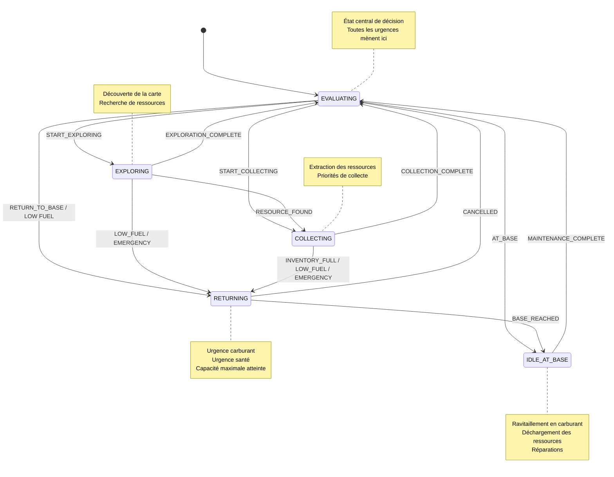

```mermaid
stateDiagram-v2
    [*] --> EVALUATING
    
    EVALUATING --> EXPLORING: START_EXPLORING
    EVALUATING --> COLLECTING: START_COLLECTING
    EVALUATING --> RETURNING: RETURN_TO_BASE / LOW FUEL
    EVALUATING --> IDLE_AT_BASE: AT_BASE
    
    EXPLORING --> EVALUATING: EXPLORATION_COMPLETE
    EXPLORING --> RETURNING: LOW_FUEL / EMERGENCY
    EXPLORING --> COLLECTING: RESOURCE_FOUND
    
    COLLECTING --> EVALUATING: COLLECTION_COMPLETE
    COLLECTING --> RETURNING: INVENTORY_FULL / LOW_FUEL / EMERGENCY
    
    RETURNING --> IDLE_AT_BASE: BASE_REACHED
    RETURNING --> EVALUATING: CANCELLED
    
    IDLE_AT_BASE --> EVALUATING: MAINTENANCE_COMPLETE
    
    note left of EVALUATING
        État central de décision
        Toutes les urgences mènent ici
    end note
    
    note right of IDLE_AT_BASE
        Ravitaillement en carburant
        Déchargement des ressources
        Réparations
    end note
    
    note right of RETURNING
        Urgence carburant
        Urgence santé
        Capacité maximale atteinte
    end note
    
    note left of EXPLORING
        Découverte de la carte
        Recherche de ressources
    end note
    
    note left of COLLECTING
        Extraction des ressources
        Priorités de collecte
    end note

```
